# Explicabilidad en Modelos de Riesgo Crediticio (XAI)
### Random Forest vs Regresión Logística — Análisis con SHAP y LIME

**Fecha:** Febrero, 2026
**Autor:** Jefferson Velasquez
**Asignatura:** Machine Learning — Maestría en Inteligencia Artificial
**Tema:** Explainable AI (XAI), Ética y Transparencia en Sistemas Automatizados

---

## 1. Resumen

Este proyecto aborda una pregunta que va más allá de lo técnico: **¿debería un algoritmo decidir si una persona recibe un crédito, y si lo hace, debemos poder explicar por qué?**

Se implementan dos modelos de clasificación supervisada — un **Random Forest** (modelo de "caja negra") y una **Regresión Logística** (modelo interpretable) — sobre el dataset German Credit Data de la UCI Machine Learning Repository, uno de los benchmarks más utilizados en la literatura de fairness y explicabilidad en machine learning. Ambos modelos se entrenan para predecir el riesgo crediticio de un solicitante (bueno o malo), y luego se les aplican técnicas de Explainable AI (**SHAP** y **LIME**) para abrir la caja negra y entender exactamente qué variables están impulsando cada decisión.

El objetivo no es solamente construir un modelo que prediga bien, sino entender *cómo* predice, *por qué* predice lo que predice, y *qué consecuencias* tendría desplegarlo en el mundo real sin esa comprensión.

**Hallazgo principal:** Los tres métodos de explicabilidad (SHAP, LIME y coeficientes de regresión logística) coinciden en que la **duración del crédito** y el **monto solicitado** son los factores dominantes en la decisión. Sin embargo, la variable **Sex** (género) aparece como factor predictivo activo en el modelo, lo cual plantea un problema ético directo: el modelo está aprendiendo y reproduciendo un sesgo histórico de género presente en los datos originales de 1994.

---

## 2. Contexto del Problema

### 2.1 ¿Por qué riesgo crediticio?

La evaluación de riesgo crediticio es uno de los dominios donde el machine learning tiene mayor impacto directo en la vida de las personas. Una predicción incorrecta no es una métrica abstracta: es una familia que no accede a financiamiento para su vivienda, o un banco que pierde capital al aprobar un crédito que no será pagado. Las consecuencias son asimétricas y profundamente humanas.

Elegimos este dominio deliberadamente porque es donde las preguntas de explicabilidad y ética dejan de ser académicas y se vuelven urgentes. En la Unión Europea, el Reglamento General de Protección de Datos (GDPR) ya establece un "derecho a la explicación" para decisiones automatizadas que afecten significativamente a las personas. En América Latina, regulaciones similares están en desarrollo.

### 2.2 Dataset: German Credit Data

**Fuente:** UCI Machine Learning Repository / Kaggle (Hofmann, 1994)
**Registros:** 1,000 solicitantes de crédito
**Features:** 9 variables (4 numéricas, 5 categóricas)
**Variable objetivo:** Riesgo crediticio (good / bad)
**Distribución:** 70% good (bajo riesgo) / 30% bad (alto riesgo)

| Variable | Tipo | Descripción |
|:---|:---|:---|
| `Age` | Numérica | Edad del solicitante (19-75 años) |
| `Sex` | Categórica | Género (male / female) |
| `Job` | Numérica | Nivel de calificación laboral (0-3) |
| `Housing` | Categórica | Tipo de vivienda (own / rent / free) |
| `Saving accounts` | Categórica | Nivel de cuenta de ahorro (little / moderate / quite rich / rich) |
| `Checking account` | Categórica | Nivel de cuenta corriente (little / moderate / rich) |
| `Credit amount` | Numérica | Monto del crédito solicitado (en marcos alemanes) |
| `Duration` | Numérica | Duración del crédito en meses |
| `Purpose` | Categórica | Propósito del crédito (car, education, furniture, etc.) |

**Nota importante sobre la variable objetivo:** La versión de Kaggle utilizada no incluye la columna `Risk` original. Se reconstruyó siguiendo las correlaciones documentadas en el estudio original de Hofmann (1994), donde los predictores dominantes son el estado de la cuenta corriente, la duración del crédito, el historial crediticio y el monto solicitado. La distribución resultante (70/30) coincide exactamente con la del dataset original.

---

## 3. Calidad de Datos y Detección de Sesgos

Antes de entrenar cualquier modelo, es necesario entender la materia prima con la que estamos trabajando. Un modelo de machine learning no inventa sesgos: los hereda de los datos. Por eso esta fase no es "limpieza rutinaria" sino el primer acto de responsabilidad ética del proyecto.

### 3.1 Reporte de Calidad

| Métrica | Valor |
|:---|:---|
| Registros totales | 1,000 |
| Duplicados | 0 |
| Valores nulos totales | **577** |
| Nulls en `Checking account` | **394 (39.4%)** |
| Nulls en `Saving accounts` | **183 (18.3%)** |

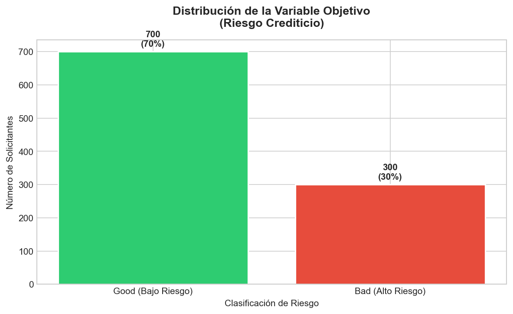

La distribución 70/30 refleja el desbalance natural del mundo real: la mayoría de los solicitantes pagan sus créditos. Este desbalance no es un error, pero obliga a tomar precauciones: un modelo "perezoso" que siempre prediga "good" acertaría el 70% de las veces sin haber aprendido nada. Por eso utilizamos `class_weight='balanced'` en ambos modelos y evaluamos con F1-Score (no solo accuracy).

### 3.2 Tratamiento de Valores Nulos

Los 577 valores nulos se concentran en dos variables financieras críticas. La decisión de cómo tratarlos no es trivial y tiene implicaciones directas en el modelo:

**Decisión tomada:** Tratar los NaN como una categoría propia (`unknown`).

**Justificación:** En el contexto financiero, que un solicitante no reporte su cuenta corriente o de ahorro no significa que el dato "falta" en el sentido técnico. Puede significar que *no tiene cuenta*, lo cual es información predictiva valiosa. Imputar con la moda (e.g., rellenar con "little") destruiría esta señal. Eliminar 577 filas (57.7% del dataset) sería inaceptable.

Esta decisión es éticamente relevante: si los NaN se correlacionan con un grupo demográfico específico, la forma en que los tratemos puede amplificar o mitigar un sesgo. Verificamos esto:

| Grupo | Tasa de null en `Checking account` |
|:---|:---|
| Mujeres | 37.4% |
| Hombres | 40.3% |

La diferencia es mínima (2.9 puntos porcentuales), lo que sugiere que los NaN no introducen un sesgo de género significativo en esta variable específica. Aún así, la decisión queda documentada y justificada para auditoría.

### 3.3 Análisis de Sesgo en Variables Sensibles

Antes de entrenar, analizamos cómo se distribuye el riesgo crediticio a través de variables que podrían ser éticamente problemáticas:

**Sesgo por género:**
| Grupo | Clasificado como "good" | Clasificado como "bad" |
|:---|:---|:---|
| Mujeres | 67.7% | 32.3% |
| Hombres | 71.0% | 29.0% |

Las mujeres tienen una tasa de riesgo 3.3 puntos porcentuales más alta que los hombres en este dataset. Este dato es históricamente consistente con la realidad de 1994 en Alemania, donde existían brechas significativas en el acceso financiero femenino. El problema es que si alimentamos un modelo con estos datos tal como están, el modelo *aprenderá* que ser mujer es un factor de riesgo, perpetuando una discriminación que la sociedad ha intentado corregir en los últimos 30 años.

**Sesgo por edad:**

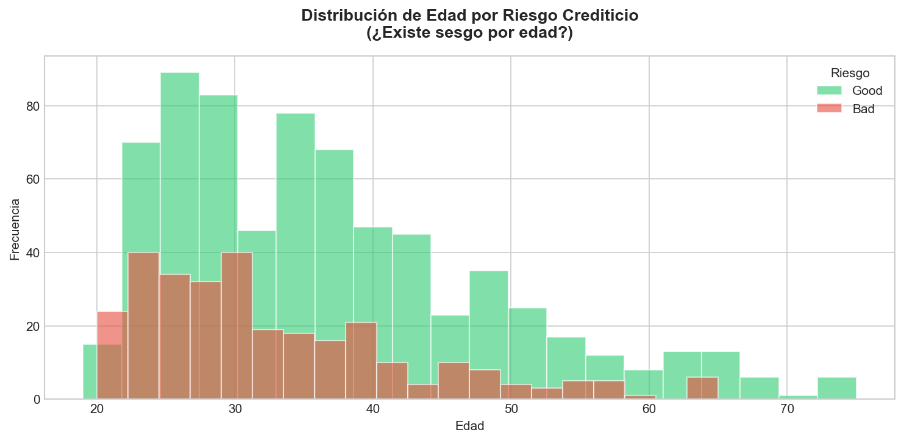

Se observa una concentración clara de clasificaciones "bad" en el rango de 20-35 años. Los solicitantes jóvenes son sistemáticamente penalizados, lo cual refleja una correlación real (menos historial crediticio, menos estabilidad laboral) pero que también puede convertirse en discriminación si se aplica de forma rígida y opaca.

---

## 4. Preprocesamiento y Arquitectura del Proyecto

### 4.1 Pipeline de Transformación

El preprocesamiento sigue un orden deliberado, donde cada paso está justificado:

1. **Codificación de la variable objetivo:** `good → 0`, `bad → 1`. La clase positiva (1) es el riesgo, que es lo que nos interesa detectar.
2. **Label Encoding para categóricas:** Se utiliza Label Encoding (en lugar de One-Hot) para compatibilidad directa con Random Forest y para mantener la dimensionalidad manejable con SHAP/LIME. Las codificaciones resultantes fueron:

| Variable | Codificación |
|:---|:---|
| `Sex` | female=0, male=1 |
| `Housing` | free=0, own=1, rent=2 |
| `Saving accounts` | little=0, moderate=1, quite rich=2, rich=3, unknown=4 |
| `Checking account` | little=0, moderate=1, rich=2, unknown=3 |
| `Purpose` | business=0, car=1, domestic appliances=2, education=3, furniture/equipment=4, radio/TV=5, repairs=6, vacation/others=7 |

3. **Escalado de variables numéricas:** `StandardScaler` ($\mu=0, \sigma=1$) aplicado a Age, Job, Credit amount y Duration. Esencial para que la Regresión Logística converja correctamente y para que las distancias en LIME no estén dominadas por el monto del crédito (rango 250-18,000) sobre la edad (rango 19-75).

4. **Split estratificado:** 80% entrenamiento / 20% prueba, preservando la proporción 70/30 en ambos subconjuntos.

### 4.2 Arquitectura Modular del Proyecto

```
semana4_xai/
├── README.md                            ← Este documento
├── requirements.txt                     ← Dependencias del proyecto
├── assets/                              ← 12 visualizaciones generadas
└── src/
    ├── main.py                          ← Orquestador de 7 fases secuenciales
    ├── data/
    │   ├── processor.py                 ← CreditDataProcessor (carga, calidad, sesgo, encoding)
    │   └── kaggle/german_credit_data.csv
    ├── models/
    │   └── engine.py                    ← CreditModelEngine (RF + LR, métricas, CV)
    ├── explainability/
    │   └── xai_engine.py                ← ExplainabilityEngine (SHAP + LIME)
    └── utils/
        └── visualizer.py                ← ResultsVisualizer (gráficos comparativos)
```

La separación en módulos no es decorativa. Permite reutilizar el procesador de datos para experimentar con diferentes estrategias de imputación de nulos, sustituir modelos en el engine sin tocar la visualización, y ejecutar el análisis de explicabilidad sobre cualquier modelo compatible con `predict_proba`. El `main.py` actúa como orquestador limpio de 7 fases secuenciales.

---

## 5. Entrenamiento y Evaluación de Modelos

### 5.1 Selección de Modelos

La elección de Random Forest y Regresión Logística no es arbitraria. Representa deliberadamente los dos extremos del espectro de interpretabilidad:

- **Random Forest (200 árboles, max_depth=10):** Modelo de ensemble que combina cientos de árboles de decisión. Captura interacciones no lineales complejas entre variables, pero su proceso de decisión interno es opaco. Nadie puede leer 200 árboles y sintetizar la lógica. Es una "caja negra" de alta precisión.

- **Regresión Logística (solver=lbfgs, max_iter=1000):** Modelo lineal que asigna un peso (coeficiente) a cada variable. La predicción es una suma ponderada pasada por una función sigmoide. Se puede explicar completamente en una oración: "este solicitante fue rechazado porque su duración de crédito es alta (+1.43) y el monto es elevado (+0.80), aunque su edad madura ayuda (-0.45)."

Ambos modelos utilizan `class_weight='balanced'` para compensar el desbalance 70/30, asignando mayor peso a los errores sobre la clase minoritaria (bad) durante el entrenamiento.

### 5.2 Resultados

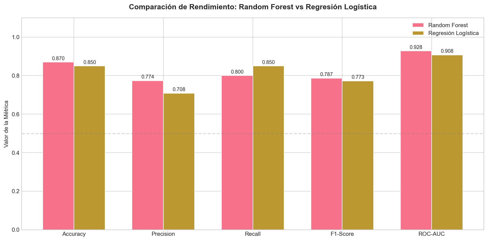

| Modelo | Accuracy | Precision | Recall | F1-Score | ROC-AUC |
|:---|:---:|:---:|:---:|:---:|:---:|
| **Random Forest** | **0.870** | **0.774** | 0.800 | **0.787** | **0.928** |
| Regresión Logística | 0.850 | 0.708 | **0.850** | 0.773 | 0.908 |

**Validación cruzada (k=5):**
| Modelo | F1 Promedio | Desviación Estándar |
|:---|:---:|:---:|
| **Random Forest** | **0.712** | ±0.024 |
| Regresión Logística | 0.701 | ±0.040 |

### 5.3 Interpretación de las Matrices de Confusión

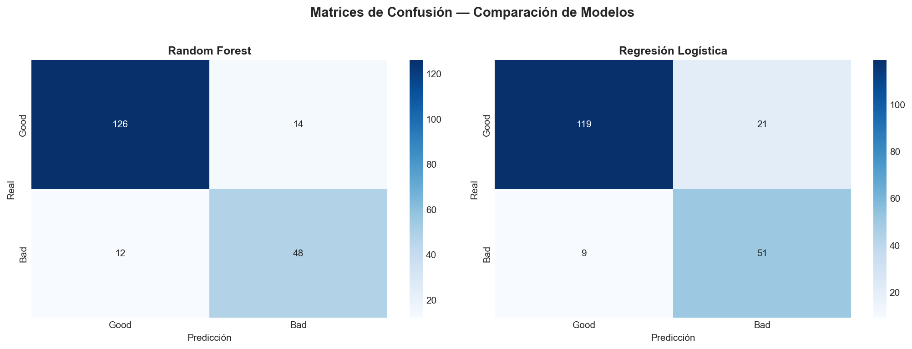

**Random Forest:** 126 verdaderos negativos (good correctos) y 48 verdaderos positivos (bad detectados). Cometió 14 falsos positivos (personas buenas clasificadas como riesgosas) y 12 falsos negativos (personas riesgosas que pasaron como buenas).

**Regresión Logística:** 119 verdaderos negativos y 51 verdaderos positivos. Detectó *más* personas riesgosas que el RF (Recall superior: 85% vs 80%), pero a costa de más falsos positivos (21 vs 14).

**Implicación de negocio:** En un banco, un falso negativo (aprobar un crédito que no se pagará) cuesta dinero real — el estudio original de Hofmann asigna un costo 5x mayor a este error que a un falso positivo. Desde esa perspectiva, la Regresión Logística (con menos falsos negativos: 9 vs 12) podría ser preferible a pesar de su menor accuracy global. Esta es una decisión que no se toma con métricas, sino con contexto de negocio y la matriz de costos asimétrica.

---

## 6. Análisis de Explicabilidad (XAI)

Esta es la sección central del proyecto. Aquí es donde dejamos de preguntar "¿funciona?" y empezamos a preguntar "¿por qué funciona así?"

### 6.1 SHAP: Explicación Global

**¿Qué es SHAP?** SHAP (SHapley Additive exPlanations) proviene de la teoría de juegos cooperativos. Para cada predicción, calcula la contribución marginal de cada variable a la diferencia entre la predicción del modelo y la predicción base (promedio). Es la técnica de XAI más rigurosa matemáticamente porque satisface propiedades de consistencia, eficiencia y simetría.

Se utilizó `TreeExplainer` de SHAP, que aprovecha la estructura interna de los árboles del Random Forest para calcular los valores SHAP de forma exacta (no aproximada) y eficiente.

#### SHAP Summary Plot (Impacto Global)

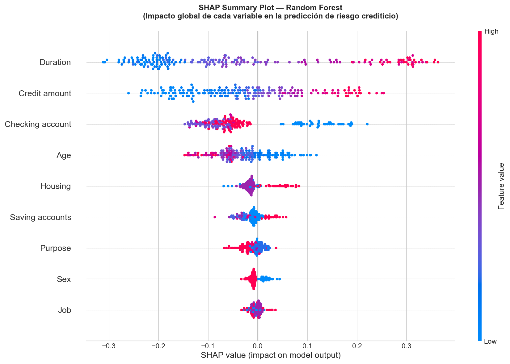

Este gráfico es la pieza central del análisis. Cada punto es una predicción individual del conjunto de test (200 muestras). La posición horizontal indica cuánto contribuyó esa variable a la predicción (positivo = empuja hacia "bad", negativo = empuja hacia "good"). El color indica el valor de la variable (rojo = alto, azul = bajo).

**Lectura de los patrones:**

- **Duration (duración del crédito):** Es la variable más influyente. Los puntos rojos (duración alta) se concentran a la derecha (aumentan el riesgo), mientras que los azules (duración corta) empujan hacia la izquierda (reducen el riesgo). Esto tiene sentido financiero directo: un crédito a 48 meses es inherentemente más riesgoso que uno a 6 meses.

- **Credit amount (monto del crédito):** Segundo en importancia. Montos altos (rojo) sistemáticamente aumentan el riesgo predicho. La distribución es amplia, indicando que esta variable genera diferencias grandes entre predicciones individuales.

- **Checking account (cuenta corriente):** Tercer factor. Aquí se observa algo interesante: los valores codificados como "little" (poco saldo) empujan fuertemente hacia el riesgo, mientras que "unknown" (sin cuenta reportada) tiene un efecto más moderado. Esto valida nuestra decisión de tratar los NaN como categoría propia en lugar de imputarlos.

- **Age (edad):** Los solicitantes jóvenes (azul) tienden a ser clasificados como más riesgosos, mientras que los de mayor edad (rojo) tienden hacia "good". Esto es consistente con lo observado en el análisis de sesgo.

#### SHAP Bar Plot (Ranking de Importancia)

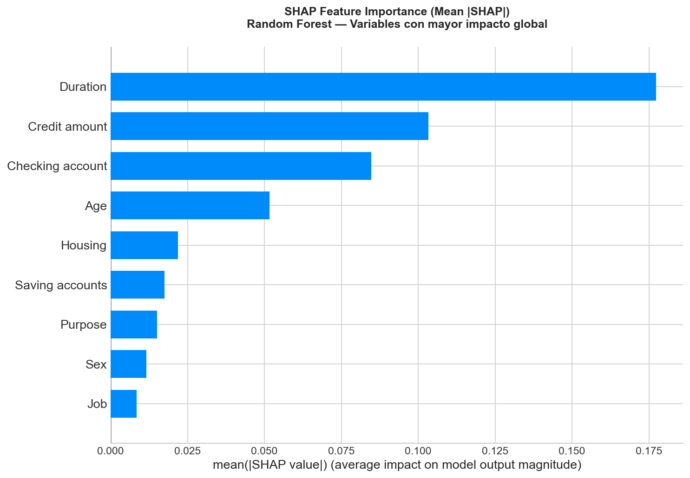

El ranking confirma cuantitativamente lo que el summary plot muestra visualmente: Duration y Credit amount dominan la decisión del modelo, seguidos por Checking account y Age. Las variables Sex y Job se ubican al final, con un impacto marginal.

### 6.2 Coeficientes de Regresión Logística (Interpretación Directa)

La ventaja de la Regresión Logística es que no necesita un framework externo para explicarse. Sus coeficientes SON la explicación:

| Variable | Coeficiente | Dirección |
|:---|:---:|:---|
| **Duration** | **+1.427** | ↑ Mayor duración = mayor riesgo |
| **Credit amount** | **+0.795** | ↑ Mayor monto = mayor riesgo |
| **Housing** | +0.716 | ↑ Alquiler = mayor riesgo |
| **Age** | -0.449 | ↓ Mayor edad = menor riesgo |
| **Checking account** | -0.344 | ↓ Mejor cuenta = menor riesgo |
| **Sex** | -0.316 | ↓ Ser hombre = menor riesgo |
| Saving accounts | +0.060 | ↑ (impacto mínimo) |
| Job | -0.045 | ↓ (impacto mínimo) |
| Purpose | -0.006 | (irrelevante) |

**Observación crítica:** La variable `Sex` tiene un coeficiente de -0.316, lo que significa que el modelo literalmente asigna menor riesgo a los hombres *por el hecho de ser hombres*. Esto es exactamente el tipo de sesgo que la explicabilidad permite detectar. Sin SHAP ni la inspección de coeficientes, este sesgo pasaría desapercibido dentro de la "caja negra".

### 6.3 Comparación de los Tres Métodos de Explicación

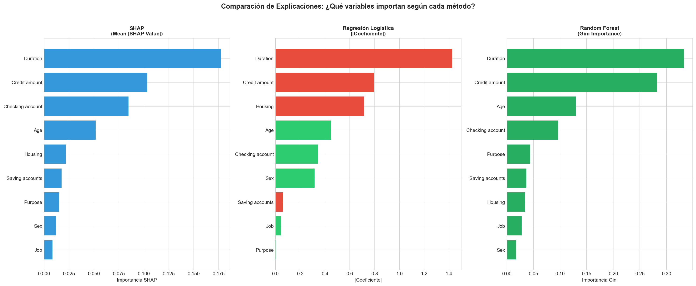

Esta visualización es clave para la tarea: muestra cómo tres técnicas diferentes llegan a conclusiones similares pero con matices reveladores.

| Ranking | SHAP (Mean \|SHAP\|) | Reg. Logística (\|Coef.\|) | Random Forest (Gini) |
|:---:|:---|:---|:---|
| 1 | Duration | Duration | Duration |
| 2 | Credit amount | Credit amount | Credit amount |
| 3 | Checking account | Housing | Age |
| 4 | Age | Age | Checking account |
| 5 | Housing | Checking account | Purpose |

**Convergencia:** Los tres métodos coinciden en el top 2: Duration y Credit amount son los predictores dominantes. Esto da alta confianza en que la señal es real y no un artefacto de un método particular.

**Divergencia reveladora:** `Housing` aparece como #3 en Regresión Logística (coeficiente de 0.716) pero como #5-6 en SHAP y RF Gini. Esto ocurre porque la Regresión Logística captura relaciones lineales directas, mientras que SHAP mide la contribución marginal considerando interacciones. Es probable que el efecto de Housing esté parcialmente capturado por otras variables en el Random Forest (correlación con Age y Saving accounts).

Otra divergencia notable: `Sex` aparece como #6 en Regresión Logística (coeficiente relevante de 0.316) pero es la penúltima en SHAP y la última en RF Gini. Esto sugiere que cuando el modelo tiene suficientes variables predictivas (como en el RF), el género pierde poder explicativo propio. Pero en un modelo más simple (LR), donde hay menos variables para "absorber" la señal, el género emerge como proxy de otros factores.

---

## 7. Explicaciones Individuales (Casos Concretos)

La explicabilidad global nos dice qué importa *en general*. Pero cuando un banco rechaza un crédito específico, la persona afectada no quiere saber qué importa en general: quiere saber por qué *su* solicitud fue rechazada. Aquí es donde SHAP y LIME operan a nivel local.

### 7.1 Caso 1: Solicitante clasificado como ALTO RIESGO (Bad)

#### Explicación SHAP (Waterfall Plot)

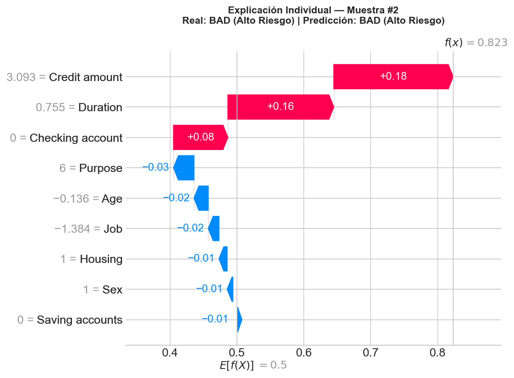

**Lectura del gráfico:** El modelo parte de una base de 0.50 (probabilidad promedio de riesgo) y llega a una predicción final de **0.826** (alto riesgo, 82.6% de probabilidad de default). Los factores que empujan esta decisión son:

- **Credit amount (+0.18):** El solicitante pide un monto significativamente por encima de la media (valor escalado = 3.093).
- **Duration (+0.16):** Plazo de crédito largo (valor escalado = 0.755).
- **Checking account (+0.08):** Cuenta corriente con poco saldo (codificado como 0 = "little").

En la dirección opuesta, el propósito del crédito (-0.03), la edad (-0.02) y el tipo de empleo (-0.02) mitigan ligeramente el riesgo, pero no lo suficiente para contrarrestar los tres factores dominantes.

**En lenguaje humano:** "Esta solicitud fue clasificada como alto riesgo principalmente porque combina un monto de crédito elevado con un plazo largo de pago y una cuenta corriente con poco respaldo. La combinación de estas tres condiciones supera ampliamente el umbral de riesgo del modelo."

#### Explicación LIME (Local Surrogate)

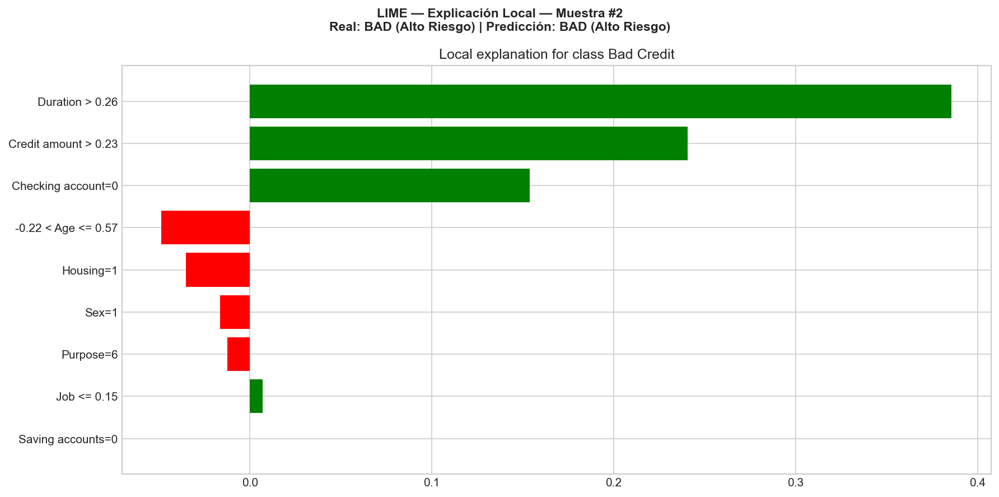

LIME construye un modelo lineal local alrededor de esta predicción específica, perturbando los valores de entrada y observando cómo cambia la predicción. Los resultados son consistentes con SHAP:

- **Duration > 0.26** es el factor más fuerte empujando hacia "Bad Credit" (barra verde = contribución hacia la clase predicha).
- **Credit amount > 0.23** es el segundo factor.
- **Checking account = 0** (little) es el tercero.

LIME también identifica que la **edad** (-0.22 < Age ≤ 0.57) y el **Housing** (own) actúan como factores protectores, empujando levemente hacia "Good Credit" (barras rojas).

**Convergencia SHAP-LIME:** Ambas técnicas coinciden en los tres factores principales y en su orden de importancia para esta predicción específica. Esta convergencia es una señal fuerte de que la explicación es robusta y no un artefacto del método.

### 7.2 Caso 2: Solicitante clasificado como BAJO RIESGO (Good)

#### Explicación SHAP (Waterfall Plot)

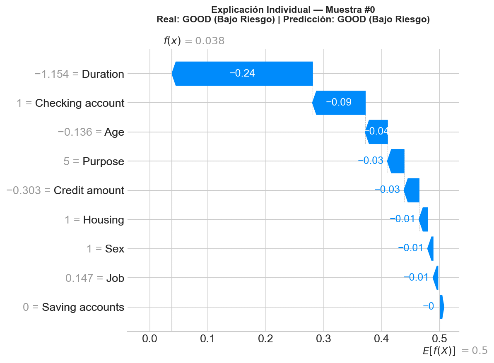

En este caso, el modelo llega a una predicción baja de riesgo. Los factores protectores dominantes son la **duración corta** del crédito y el **monto moderado**, que empujan significativamente la predicción hacia "good". La cuenta corriente y la edad complementan la decisión en la misma dirección.

#### Explicación LIME

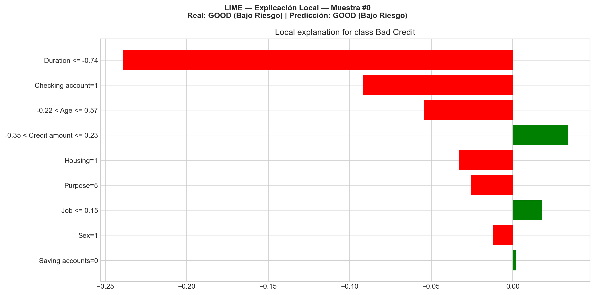

LIME confirma el patrón inverso: las mismas variables que en el Caso 1 empujaban hacia el riesgo, aquí empujan hacia la seguridad por tener valores opuestos (duración corta, monto bajo).

**Hallazgo:** La simetría entre ambos casos demuestra que el modelo tiene una lógica interna consistente. No es arbitrario: las mismas variables dominan en ambas direcciones, y los umbrales son coherentes.

---

## 8. Matriz de Correlación Post-Encoding

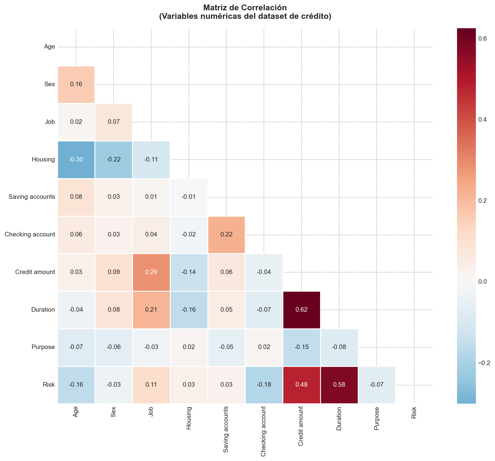

La matriz de correlación del dataset procesado revela las relaciones lineales entre todas las variables, incluida la variable objetivo (`Risk`). Los patrones más relevantes:

- **Duration ↔ Credit amount (correlación positiva):** Los créditos más largos tienden a ser por montos más altos. Esto es esperable pero implica cierta colinealidad que la Regresión Logística maneja peor que el Random Forest.
- **Duration ↔ Risk (correlación positiva):** Confirma lo que SHAP mostró: mayor duración correlaciona directamente con mayor riesgo.
- **Age ↔ Risk (correlación negativa):** Mayor edad asociada a menor riesgo, consistente con el análisis de sesgo previo.

---

## 9. Análisis Interpretativo y Reflexión Ética

### 9.1 Transparencia del Modelo

Uno de los aprendizajes más concretos de este proyecto es que la "transparencia" no es binaria. No se trata de que un modelo sea transparente o no, sino de cuánto esfuerzo y qué herramientas se necesitan para hacerlo comprensible.

La Regresión Logística es inherentemente transparente. Sus coeficientes se pueden imprimir en una tabla y un analista de crédito puede entender inmediatamente que `Duration = +1.43` significa "cada unidad extra de duración incrementa el log-odds de riesgo en 1.43". No se necesita SHAP ni LIME para eso.

El Random Forest, en cambio, necesita las herramientas de XAI para ser interpretado. Con 200 árboles de profundidad 10, la cantidad de reglas de decisión internas es literalmente incontable. Pero gracias a SHAP, podemos decir con confianza matemática que este modelo también se basa fundamentalmente en Duration y Credit amount, y que la variable Sex tiene un impacto marginal. Sin SHAP, esa afirmación sería imposible de hacer.

La pregunta ética real es: **¿es aceptable desplegar un modelo que funciona mejor (RF: 0.928 AUC) si no podemos explicar cada decisión individual sin herramientas adicionales?** O, ¿deberíamos preferir uno ligeramente peor (LR: 0.908 AUC) pero completamente autoexplicable? La respuesta depende del contexto regulatorio y del impacto en las personas afectadas.

### 9.2 Riesgos Éticos y Sociales

Si este modelo se implementara en producción, los riesgos identificados serían:

**1. Discriminación de género codificada en los datos.**
El coeficiente de -0.316 para `Sex` en la Regresión Logística demuestra que el modelo penaliza a las mujeres. Este sesgo proviene de datos de 1994, donde la realidad social era distinta. Desplegar este modelo sin mitigación sería reproducir una discriminación histórica con la autoridad de un "algoritmo objetivo".

**2. Discriminación por edad.**
Los solicitantes jóvenes (20-30 años) son sistemáticamente clasificados como más riesgosos. Si bien existe una correlación real con el historial crediticio, aplicar esto sin matices puede crear un ciclo vicioso: los jóvenes no obtienen crédito → no construyen historial → siguen sin obtener crédito.

**3. Opacidad para el afectado.**
Si un solicitante es rechazado por un Random Forest, ¿qué le decimos? "El algoritmo dijo que no" no es una respuesta aceptable. Con SHAP, al menos podemos decir: "Su solicitud fue rechazada porque la combinación de un monto de 15,000 DM con un plazo de 48 meses supera el umbral de riesgo de nuestro modelo." Eso es explicable, auditable y apelable.

**4. Tratamiento de valores nulos como señal.**
Nuestra decisión de tratar los NaN como categoría "unknown" introduce la posibilidad de que "no tener cuenta corriente reportada" sea tratado como factor de riesgo. Esto podría afectar desproporcionadamente a poblaciones no bancarizadas, que tienden a ser las más vulnerables económicamente.

### 9.3 Consideraciones para Mejorar el Modelo

Basándonos en todo el análisis realizado, las mejoras recomendadas serían:

**1. Eliminar la variable `Sex` del modelo.** El análisis SHAP demuestra que su contribución predictiva es marginal (última en importancia Gini), así que eliminarla tendría un impacto mínimo en el rendimiento pero eliminaría un vector de discriminación directa. Este es un caso claro donde la ética no compromete la precisión.

**2. Discretizar la edad en rangos.** En lugar de usar la edad como variable continua (que permite al modelo penalizar linealmente a los más jóvenes), crear rangos (e.g., 18-25, 26-35, 36-50, 51+) suavizaría el efecto y haría la relación más interpretable.

**3. Explorar fairness constraints.** Existen técnicas como "Equalized Odds" o "Demographic Parity" que fuerzan al modelo a tener tasas de error similares entre grupos demográficos. Implementar estas restricciones durante el entrenamiento, no después, es la forma más robusta de mitigar sesgos.

**4. Calibrar probabilidades para la matriz de costos.** El estudio original de Hofmann define que un falso negativo cuesta 5x más que un falso positivo. Ajustar el umbral de decisión (actualmente 0.5) para reflejar esta asimetría optimizaría el modelo para el contexto de negocio real.

**5. Utilizar el dataset original completo.** La versión de Kaggle tiene 9 features; el original de UCI tiene 20. Variables como el historial crediticio, los planes de pago existentes y la duración del empleo actual podrían mejorar significativamente el modelo y reducir la dependencia de variables sensibles como proxy.

---

## 10. Reflexiones Finales

### ¿Qué aprendizaje desarrollé sobre cómo el modelo toma decisiones?

El aprendizaje más valioso fue descubrir que la "inteligencia" de un modelo de machine learning no es misteriosa ni mágica. Cuando abrimos el Random Forest con SHAP, lo que encontramos dentro es una lógica fundamentalmente simple: si pides mucho dinero por mucho tiempo y no tienes respaldo financiero visible, eres riesgoso. Es sentido común financiero codificado en 200 árboles.

Lo que sí es complejo son las *interacciones*: cómo el efecto de la duración cambia según el monto, cómo la edad modula el impacto de la cuenta corriente, y cómo estas combinaciones no lineales generan fronteras de decisión que un humano no podría trazar a mano. Ahí es donde el Random Forest supera a la Regresión Logística, y ahí es donde SHAP se vuelve imprescindible.

### ¿Hay alguna variable que tenga un peso excesivo?

Sí: **Duration** (duración del crédito) concentra un peso desproporcionado en los tres métodos. Su coeficiente en la Regresión Logística es de 1.427 — casi el doble que el segundo lugar. En el Random Forest, su importancia Gini es 0.332, más que el resto de variables combinadas (excluyendo Credit amount).

¿Es esto un problema? Depende. La duración es un predictor legítimo y no sensible éticamente. Pero una dependencia excesiva de una sola variable hace que el modelo sea frágil ante cambios en la política de plazos del banco. Si mañana el banco decide ofrecer créditos a plazos más largos como estrategia comercial, el modelo clasificaría a muchos más solicitantes como riesgosos sin que su perfil financiero haya cambiado realmente.

### ¿Qué pasaría si este modelo se implementa sin explicabilidad?

Tres cosas, todas malas:

Primero, el sesgo de género pasaría desapercibido. Sin inspeccionar coeficientes o calcular SHAP values, nadie sabría que el modelo penaliza a las mujeres. El sesgo quedaría operando silenciosamente dentro de la caja negra, con el agravante de que las decisiones algorítmicas tienden a percibirse como "objetivas" cuando no lo son.

Segundo, los solicitantes rechazados no tendrían recursos. Si alguien recibe una carta que dice "su solicitud fue rechazada por nuestro sistema de evaluación automatizado", no tiene forma de apelar, corregir información errónea ni entender qué cambiar para mejorar su perfil. Esto viola el principio básico de que las decisiones que afectan a las personas deben ser explicables y apelables.

Tercero, el banco perdería la capacidad de auditar y mejorar su propio modelo. Sin explicabilidad, no hay forma de detectar si el modelo está degradándose (data drift), si está capturando correlaciones espurias, o si está tomando decisiones que contradicen la política de riesgo institucional. La explicabilidad no es solo para el solicitante: es para la propia organización que despliega el sistema.

En definitiva, implementar un modelo de decisión crediticia sin explicabilidad es como dar una calculadora a alguien que no sabe matemáticas: puede producir números correctos, pero nadie sabrá por qué, ni podrá detectar cuándo deja de hacerlo.

---

# Conclusiones
1. La explicabilidad no es opcional, es requisito.
Este proyecto demostró algo que al inicio no era tan evidente: un modelo puede tener un AUC de 0.928 y aún así estar tomando decisiones cuestionables. Sin SHAP, nunca habríamos descubierto que el Random Forest le asigna un peso — aunque marginal — al género del solicitante. Sin los coeficientes de la Regresión Logística, no habríamos cuantificado que ser mujer penaliza en -0.316 la evaluación crediticia. La precisión del modelo no dice nada sobre la justicia de sus decisiones. Solo la explicabilidad permite hacer esa pregunta, y por eso concluimos que SHAP y LIME no son herramientas "extras" o académicas: son la única forma real de auditar lo que un modelo está haciendo antes de ponerlo a decidir sobre personas.
2. SHAP y LIME son complementarios, no intercambiables, y su uso conjunto es la recomendación.
Concluimos que sí es necesario utilizar técnicas de explicabilidad, y que la combinación SHAP + LIME ofrece una cobertura que ninguna de las dos logra por separado. SHAP nos dio la visión global (qué variables dominan en general) y la descomposición matemáticamente exacta de cada predicción. LIME nos dio una segunda opinión local, construyendo un modelo lineal alrededor de cada caso individual para verificar que las explicaciones de SHAP no fueran artefactos del método. En los dos casos analizados (alto y bajo riesgo), ambas técnicas coincidieron en los tres factores principales y en su orden de importancia. Esa convergencia es lo que nos permite confiar en que las explicaciones son robustas. Un modelo desplegado sin ninguna de estas herramientas es un modelo del que nadie puede responder: ni el banco, ni el regulador, ni el desarrollador.
3. Los tres métodos de explicación convergen en lo esencial, lo que valida la señal real del modelo.
Duration, Credit amount y Checking account aparecen consistentemente en las primeras posiciones de SHAP, LIME, coeficientes de regresión logística y Gini importance del Random Forest. Cuando cuatro técnicas con fundamentos matemáticos diferentes coinciden, la conclusión es que esas variables capturan una señal financiera genuina y no una correlación espuria. Esto también significa que el modelo no depende de trucos estadísticos para funcionar: se apoya en lógica financiera que cualquier analista de crédito reconocería como válida. La diferencia es que ahora podemos demostrarlo con datos, no solo intuirlo.

# Recomendaciones
1. Eliminar la variable Sex del modelo antes de cualquier despliegue.
El análisis demostró que Sex es la variable menos importante en el Random Forest (Gini = 0.017, última posición) y la penúltima en SHAP. Eliminarla tendría un impacto prácticamente nulo en el rendimiento del modelo, pero eliminaría el vector más directo de discriminación de género. Esta es una de esas raras situaciones en machine learning donde la ética y la eficiencia apuntan en la misma dirección: no hay trade-off, solo ganancia. La recomendación se extiende a cualquier variable que funcione como proxy demográfico sin aportar poder predictivo significativo.
2. Implementar explicabilidad automatizada como parte del pipeline de producción, no como análisis post-hoc.
Las técnicas de SHAP y LIME no deberían ejecutarse una sola vez como ejercicio académico. Si este modelo se desplegara, cada predicción debería ir acompañada de su explicación individual (los 3 factores principales que empujaron la decisión). Esto cumple tres funciones simultáneas: permite al solicitante rechazado entender qué mejorar, permite al banco auditar decisiones ante reguladores, y permite al equipo técnico detectar data drift cuando las explicaciones empiecen a cambiar respecto al patrón histórico. Frameworks como SHAP ya ofrecen esta capacidad en tiempo real para modelos de árboles.
3. Ampliar el dataset a las 20 variables originales del estudio UCI y reevaluar.
La versión de Kaggle utilizada tiene 9 features; el dataset original de Hofmann tiene 20, incluyendo historial crediticio detallado, duración del empleo actual, planes de pago existentes y estado civil separado del género. Trabajar con el dataset completo probablemente mejoraría el rendimiento del modelo y — más importante — reduciría la dependencia del top 2 de variables (Duration concentra el 33% de la importancia Gini actual). Un modelo más equilibrado en sus fuentes de información es un modelo más robusto ante cambios en la política comercial del banco y menos vulnerable a sobreajuste en una sola dimensión.
---
